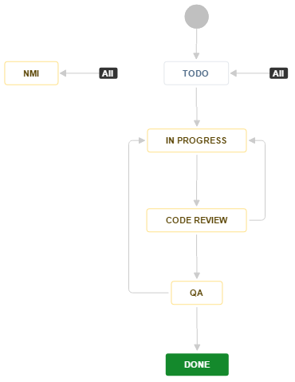

# Table of Contents

* [Contributing to REW CRM](#intro)
* [Merge Requests](#merge-requests)
* [Git Messaging](#git-messaging)
* [Acceptance Criteria](#acceptance-criteria)
* [Writing Tests](#writing-tests)
* [Resources](#resources)

<a name="intro"></a>
# Contributing to REW CRM

Want to get involved? Thanks! There are plenty of ways you can help!

Please take a moment to review this document in order to make the contribution process easy and effective for everyone involved.

Following these guidelines helps to communicate that you respect the time of the developers managing and developing this project. In return, they should reciprocate that respect in addressing your issue or assessing patches and features.

<a name="merge-requests"></a>
# Merge Requests

Good pull requests - patches, improvements, new features - are a fantastic help. They should remain focused in scope and avoid containing unrelated commits.

Please adhere to the coding standards and any other requirements (such as test coverage).

Adhering to the following process is the best way to get your work included in the project:

1. Select a ticket from the Jira board's To Do section

2. Assign yourself to the ticket and move it to Jira's In Progress column

3. Create a branch from the latest version of the framework, and name the branch after your Jira ticket's ID (IE: BREW48-001)

    ```bash
    git fetch framework dev
    git checkout -b <JIRA-TICKET-ID> framework/dev
    ```

4. Commit your changes in logical chunks. Please adhere to these [git commit message guidelines](#git-messaging) or your code is unlikely to be merged into the framework. 
   Use Git's [interactive rebase](https://help.github.com/articles/about-git-rebase/) feature to tidy up your commits before making them public.
   Look over these [acceptance criteria](#acceptance-criteria) and make sure you've met all requirements before pushing your changes.

5. Locally rebase your work on to the latest changes to the framework version.

    ```bash
    git checkout <JIRA-TICKET-ID>
    git fetch framework dev
    git pull --rebase framework dev
    ```

6. [Run e2e tests](https://gist.github.com/rewmike/e3a079b48b0aab3871085cda6f666184) on your local repo to ensure that none of them will fail when you push your changes to the upstream repo.

7. Push your branch up to your fork:

    ```bash
    git push framework <JIRA-TICKET-ID>
    ```

8. [Open a Merge Request](https://git.rewhosting.com/rew/rew-framework/merge_requests/new) with a clear title and description. Read [Git Messaging](#git-messaging) for guidelines.

9. [Generate a changelog entry](https://git.rewhosting.com/rew/rew-framework/blob/dev/docs/guides/changelog.md) and push it up to the merge request's branch

10. Add a comment to your Jira ticket with a link to the merge request.

11. Double check that your Jira ticket is in the current active sprint. If not, move it into the sprint.

12. Unassign yourself from the Jira ticket, and move it to the Code Review column.



A code reviewer will then double check your work and leave any comments directly in the merge request, or in the Jira ticket.
If there are any issues with the request, the ticket will be assigned back to the developer with details on how to get it accepted.
Otherwise, if the ticket is accepted, the code reviewer will merge the changes in and then pass the ticket to the QA team for quality assurance testing. 

If the QA team finds any issues with the work that has been done, they will assign the ticket back to the developer with instructions on how to get it approved, and move it back to the In Progress column. 

Otherwise, the changes will be approved and the ticket will be marked complete.

<a name="git-messaging"></a>
# Git Messaging

* [Summarizing Your Work](http://tbaggery.com/2008/04/19/a-note-about-git-commit-messages.html)
* Writing Commits
 * Commit messages should be in present tense (IE: "Add" vs. "Added", "Adding", etc...)
 * The first line should contain the `JIRA TICKET ID` followed by a colon and a brief/informative description of the changes being made
  * EG: `BREW48-001: Add a delete button to lead summary pages`
* Submitting Merge Requests
 * The title should contain the ticket ID and a summary of the changes made.
  * EG: `BREW48-001: Add a delete button to lead summary pages`
 * The description should contain any additional relevant information that didn't fit into the title.


<a name="acceptance-criteria"></a>
# Acceptance Criteria

* [ ] ESLint passes
* [ ] StyleLint passes
* [ ] Code conforms to [PSR](http://www.php-fig.org/psr/)-1/2/4 and [REW](http://docs.rewpert.com/coding-guidelines) guidelines
* [ ] Accurate documentation
 * [ ] PHPDocs (Classes, Controller-Rendered TPLs)
 * [ ] Commit messages [(See Git Messaging)](#git-messaging) 
 * [ ] Merge request details [(See Git Messaging)](#git-messaging)
* [ ] Unit Tests are included (New Classes)
* [ ] E2E Tests are included (New endpoints/features, Changes to authentication/permission requirements)


<a name="writing-tests"></a>
# Writing Tests

* [Writing Smoke Tests](https://realestatewebmasters.atlassian.net/wiki/display/EN/Smoke+Tests+in+Windows)
* [Running Smoke Tests Locally](https://gist.github.com/rewmike/e3a079b48b0aab3871085cda6f666184)
* [Example of Writing a Unit Test](https://git.rewhosting.com/rew/rew-framework/blob/dev/tests/unit/Backend/Module/FeedSwitcher/ModuleTest.php)

<a name="resources"></a>
# Resources

* Site Installation
 * [Frontend](README.md)
 * [Backend](backend/README.md)
* Jira
 * [CRM Board](https://realestatewebmasters.atlassian.net/secure/RapidBoard.jspa?rapidView=101)
 * [Framework Integration Board] (https://realestatewebmasters.atlassian.net/secure/RapidBoard.jspa?rapidView=73)
* Code Standards
 * [Code Standards (WIP)] (https://docs.google.com/document/d/116z-owwJN382ZiO9CxmRUpWeiFRhUgQdsKZ3AGjM1Uc/edit)
* Git Repos
 * [CRM](https://git.rewhosting.com/rew/rew-framework/)
 * [CRM Interfaces] (https://git.rewhosting.com/rew/rew-framework-interfaces)
 * [CRM Documentation] (https://git.rewhosting.com/rew/rew-crm-docs)
 * [Page Objects] (https://git.rewhosting.com/rew/rew-page-objects)
